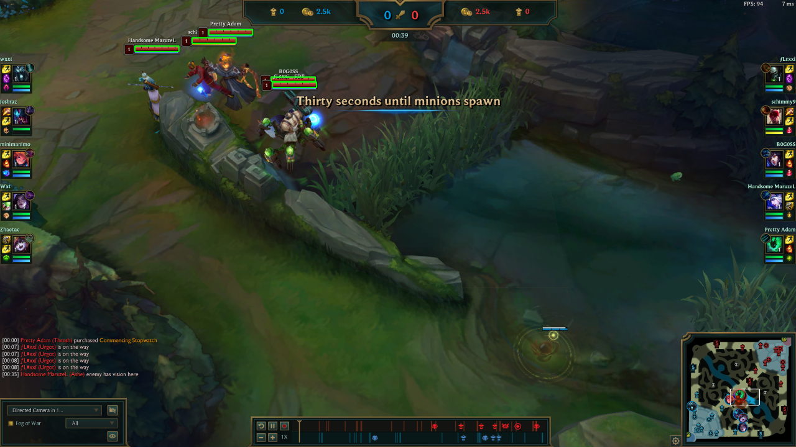
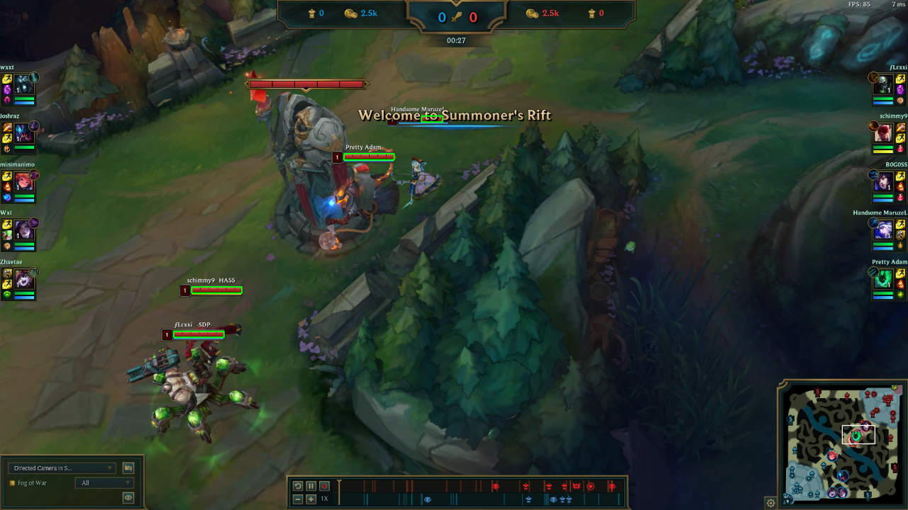
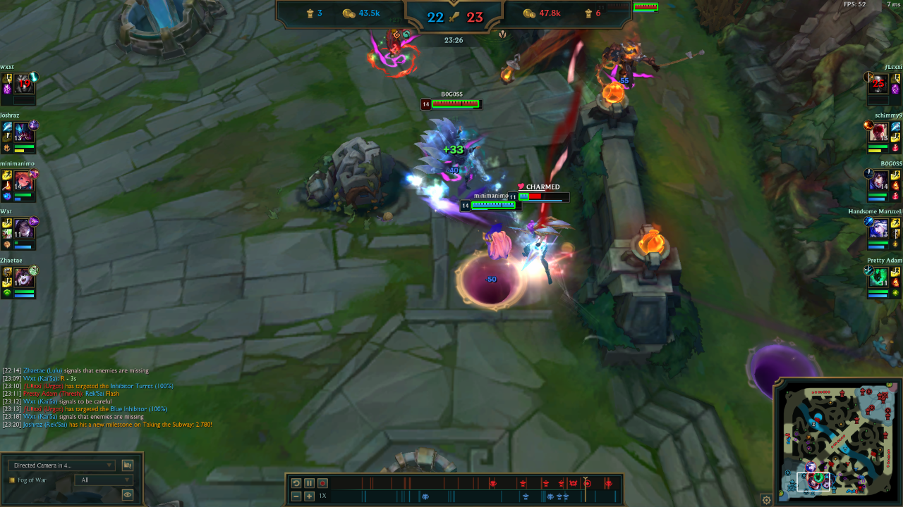
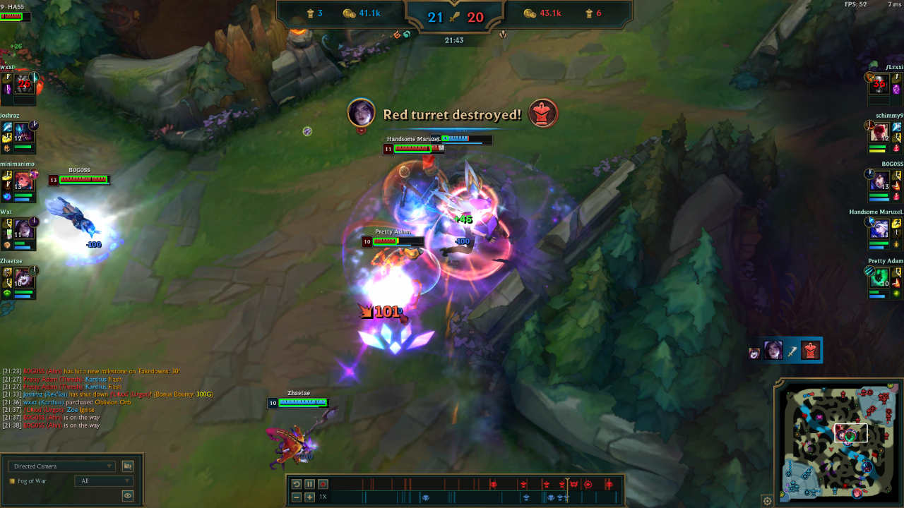

# League of Legends health bar detector

## About
Color based algorithm I created for esportsLABgg League Vision Challenge competition. 

## Setup
1. Unpack all files
2. Check if `main.py` is executable
3. To display number of detected bars use `python main.py path/image.png` where `path/image.png` is path to input image.
4. You are also able to see detected bars by calling `show_detected_bars` method inside `main.py`.

## Technologies
* Python - version 3.7.3
* Opencv2
* Numpy

## Results

